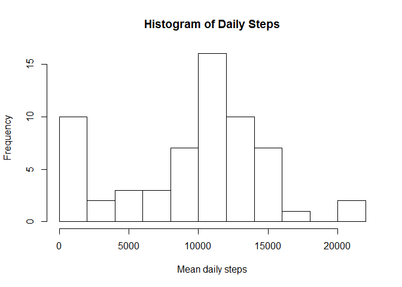

# Reproducible Research - Project 1
Bill Holst  
January 5, 2016  
## Overview

This is an R markdown file that facilitates repeatable, reproducible research. This file supports Project One in the Reproducible Research segment of the Coursera class.

Please see the Readme.md document for a detailed description of the project.

## Loading and preprocessing the data

First, we need to establish our work environment and download the file if we haven't done so already. The unzipped file is called activity.csv.


```r
setwd("~/GitHub/RepData_PeerAssessment1")
dir ()
```

```
##  [1] "activity.csv"              "activity.zip"             
##  [3] "doc"                       "instructions_fig"         
##  [5] "PA1_template.html"         "PA1_template.Rmd"         
##  [7] "README.md"                 "ReproducibleResearch.html"
##  [9] "ReproducibleResearch.Rmd"  "zipfile.zip"
```

```r
UrlName<-"http://d396qusza40orc.cloudfront.net/repdata%2Fdata%2Factivity.zip"

zipfile<- "zipfile.zip"

# don't download file if we have already
if (!file.exists(zipfile)) {
    fileUrl <- UrlName
    download.file(fileUrl,destfile=zipfile)
    
    dateDownloaded<-date()
    dateDownloaded
    # 
    # Extract the downloaded zip file
    #
    unzip(zipfile)
}
# Read the data and take a look

ActivityData = read.csv ("activity.csv")
dim(ActivityData)
```

```
## [1] 17568     3
```

```r
summary(ActivityData)
```

```
##      steps                date          interval     
##  Min.   :  0.00   2012-10-01:  288   Min.   :   0.0  
##  1st Qu.:  0.00   2012-10-02:  288   1st Qu.: 588.8  
##  Median :  0.00   2012-10-03:  288   Median :1177.5  
##  Mean   : 37.38   2012-10-04:  288   Mean   :1177.5  
##  3rd Qu.: 12.00   2012-10-05:  288   3rd Qu.:1766.2  
##  Max.   :806.00   2012-10-06:  288   Max.   :2355.0  
##  NA's   :2304     (Other)   :15840
```

## What is mean total number of steps taken per day?

A quick look at the data via the summary shows the mean number of steps per 5 minute interval to be 37.38. With 288 periods in a day, that is a mean of around 10766 per day. Note that this is an approximation used only as a sanity check for when we actually compute the actual mean. We look at this more in a daily analysis.

First compute the total steps for each day. Then calculated the mean and median.


```r
DailySteps =  aggregate(x = ActivityData$steps , by =     list(ActivityData$date), FUN = sum ,na.rm=TRUE)
names(DailySteps) = c("Date","Daily.Steps")
```
The daily mean and median steps are:

```r
mean(DailySteps$Daily.Steps)
```

```
## [1] 9354.23
```

```r
median(DailySteps$Daily.Steps)
```

```
## [1] 10395
```

We can also view the daily step data as a histogram, so we understand what the typical daily profile might be.


```r
hist(DailySteps$Daily.Steps,15, xlab="Mean daily steps",main="Histogram of Daily Steps")
```

 

## What is the average daily activity pattern?

The next question to address is what the daily pattern for step activity is for the subject. 


To provide this information, we make a time series plot (i.e. type = "l") of the 5-minute interval (x-axis) and the average number of steps taken, averaged across all days (y-axis).


```r
library(ggplot2)
TimeSeries = aggregate(x = ActivityData$steps,by =     list(ActivityData$interval), FUN = mean, na.rm = TRUE )
names(TimeSeries) <- c("Interval","Steps")
ggplot(TimeSeries,aes(Interval,Steps)) +
     ggtitle("Time Series Plot - Mean Steps by Interval") +
     geom_line()
```

 

Which 5-minute interval, on average across all the days in the dataset, contains the maximum number of steps?  To determine this we find the max and then find the interval when that occurs.


```r
MaxSteps = max(TimeSeries$Steps)
# Select the interval when the max occurs
int=TimeSeries[TimeSeries$Steps==MaxSteps,]
cat("Maximum steps are",round(MaxSteps), "occuring in interval", int[,1])
```

```
## Maximum steps are 206 occuring in interval 835
```


## Imputing missing values

There are a fairly large number of missing values (marked as NA) in the dataset.  We offer an approach to impute these values.

First we find out the extent of the missing values, i.e. how many rows contain NAs.


```r
library(scales)
cat("Total number of missing step records:",nrow(ActivityData[is.na(ActivityData$steps),]))
```

```
## Total number of missing step records: 2304
```

```r
cat("which represents",percent(nrow(ActivityData[is.na(ActivityData$steps),])/
                              nrow(ActivityData[])),"of the total.")
```

```
## which represents 13.1% of the total.
```

We will fill the missing values with the mean for the interval over the entire period, which represents a typical daily profile.  The TimeSeries variable contains this data.


```r
ActivityData.ImputedSteps = merge(ActivityData, TimeSeries, by.x = "interval", by.y = "Interval", all.x = TRUE)
summary(ActivityData.ImputedSteps)
```

```
##     interval          steps                date           Steps        
##  Min.   :   0.0   Min.   :  0.00   2012-10-01:  288   Min.   :  0.000  
##  1st Qu.: 588.8   1st Qu.:  0.00   2012-10-02:  288   1st Qu.:  2.486  
##  Median :1177.5   Median :  0.00   2012-10-03:  288   Median : 34.113  
##  Mean   :1177.5   Mean   : 37.38   2012-10-04:  288   Mean   : 37.383  
##  3rd Qu.:1766.2   3rd Qu.: 12.00   2012-10-05:  288   3rd Qu.: 52.835  
##  Max.   :2355.0   Max.   :806.00   2012-10-06:  288   Max.   :206.170  
##                   NA's   :2304     (Other)   :15840
```

```r
# note that the "steps" variable in the TimeSeries had been renamed to "Steps"

ActivityData.ImputedSteps[is.na(ActivityData.ImputedSteps$steps),c("steps")] <-     ActivityData.ImputedSteps[is.na(ActivityData.ImputedSteps$steps),c("Steps")]

# Find the total daily numbers with the imputed values

DailySteps.Imputed =  aggregate(x = ActivityData.ImputedSteps$steps , 
                                by = list(ActivityData.ImputedSteps$date), 
                                FUN = sum ,na.rm=TRUE)
names(DailySteps.Imputed) <- c("Date","Daily.Steps")
```

The daily mean and median steps are:

```r
mean(DailySteps.Imputed$Daily.Steps)
```

```
## [1] 10766.19
```

```r
median(DailySteps.Imputed$Daily.Steps)
```

```
## [1] 10766.19
```
The mean and are now both greater, because we have essentially added values to intervals within days that did not have data.  Thus, the daily totals are all generally higher, resulting in larger mean and median values.

We can now view the imputed daily step data as a histogram, so we understand what the typical daily profile might be.  Note that this differs from the prior histogram, in that frequency of days near zero has dropped, thereby shifting the mean and median higher. 


```r
hist(DailySteps.Imputed$Daily.Steps,15, xlab="Mean daily steps (imputed)",main="Histogram of Daily Steps (Imputed")
```

 

## Are there differences in activity patterns between weekdays and weekends?

To determine this, we must tag each record whether it is a weekday or weekend.

For this part, we use the weekdays() function to put the data into two separate groups, one for weekdays and one for weekends. We plot these on the same graph to observe the difference.


```r
ActivityData.ImputedSteps$weekday = as.factor(ifelse(weekdays(as.Date(ActivityData.ImputedSteps$date)) %in% c("Saturday","Sunday"), "Weekend", "Weekday")) 

StepsbyInterval.Weekday.Weekend =
    aggregate(x = ActivityData.ImputedSteps$steps,
    by = list(ActivityData.ImputedSteps$interval,
    ActivityData.ImputedSteps$weekday),
    FUN = sum ,na.rm=TRUE)
names(StepsbyInterval.Weekday.Weekend) = c("Interval","weekend","Steps")


WeekEndSteps = StepsbyInterval.Weekday.Weekend[StepsbyInterval.Weekday.Weekend$weekend=='Weekend',]
WeekDaySteps=StepsbyInterval.Weekday.Weekend[StepsbyInterval.Weekday.Weekend$weekend=='Weekday',]
```

The project instructions suggested the use of a panel plot containing a time series plot (i.e. type = "l") of the 5-minute interval (x-axis) and the average number of steps taken, averaged across all weekday days or weekend days (y-axis).


```r
ggplot(StepsbyInterval.Weekday.Weekend, aes(Interval,Steps))+geom_line()+
     facet_wrap( ~ weekend , ncol=1)
```

 

However, after producing this, the graph did not clearly indicate the direct difference between weekday and weekend activity.  Therefore, we present a simple plot with both data displayed on the same graph over the same time period.  It clearly indicates that the subject is more active earlier in the day on weekdays. The individual seems to wake every day around 6am and take a morning walk during the week around 9am; s(he) seems to sleep in during the same period on weekends.  


```r
# plot on the same graph


ggplot() + geom_line(data=WeekDaySteps, 
    aes (x=Interval,y=Steps,color="Weekday")) +
    geom_line (data=WeekEndSteps,
    mapping = aes(x=Interval,y=Steps,color="Weekend")) +
    labs(color="Week Period")
```

 

##References

This is an R Markdown document. Markdown is a simple formatting syntax for authoring HTML, PDF, and MS Word documents. For more details on using R Markdown see <http://rmarkdown.rstudio.com>

The Coursera overview for this course, see
<https://www.coursera.org/learn/reproducible-research/home/welcome>
